# [Tellusim Core SDK Manual](https://tellusim.com/core-sdk/)

Low-level API examples using C++, C#, Rust, Python, Swift, Java, and Kotlin languages

https://tellusim.com/

---

## Hello Controller

https://github.com/Tellusim/Manual/tree/main/12_hello_controller/

---

## [Hello Bindless](https://tellusim.com/11_hello_bindless/)

https://github.com/Tellusim/Manual/tree/main/11_hello_bindless/

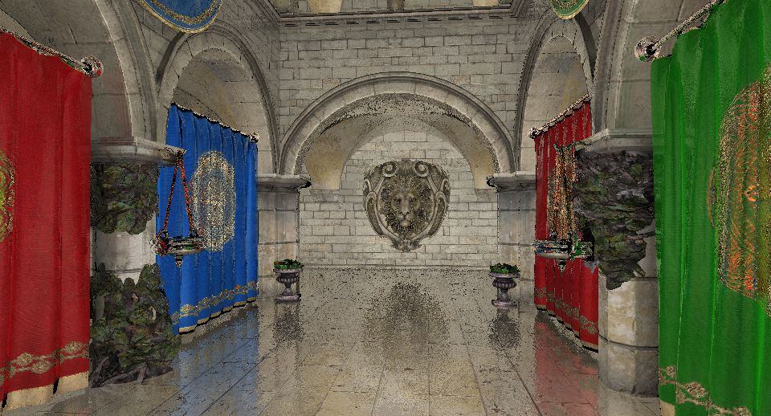

---

## [Hello Image](https://tellusim.com/10_hello_image/)

https://github.com/Tellusim/Manual/tree/main/10_hello_image/

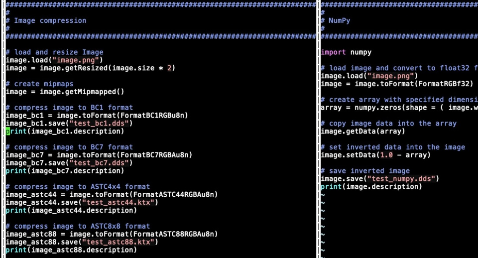

---

## [Hello Controls](https://tellusim.com/09_hello_controls/)

https://github.com/Tellusim/Manual/tree/main/09_hello_controls/

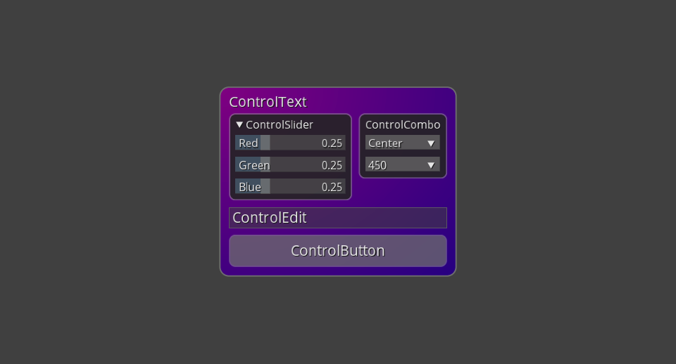

---

## [Hello Canvas](https://tellusim.com/08_hello_canvas/)

https://github.com/Tellusim/Manual/tree/main/08_hello_canvas/

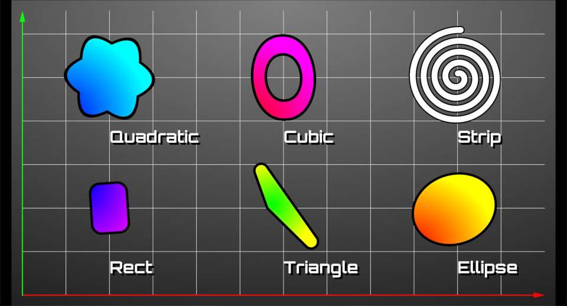

---

## [Gaussian Splatting](https://tellusim.com/07_hello_splatting/)

https://github.com/Tellusim/Manual/tree/main/07_hello_splatting/

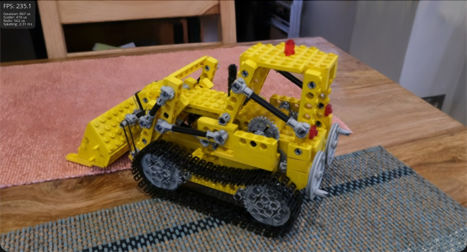

---

## [Ray Tracing with Traversal](https://tellusim.com/06_hello_traversal/)

https://github.com/Tellusim/Manual/tree/main/06_hello_traversal/

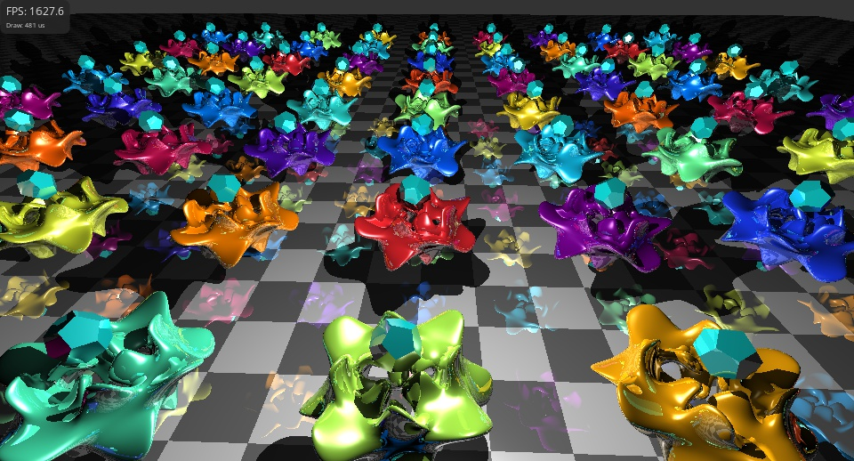

---

## [Ray Tracing with Ray Queries](https://tellusim.com/05_hello_tracing/)

https://github.com/Tellusim/Manual/tree/main/05_hello_tracing/

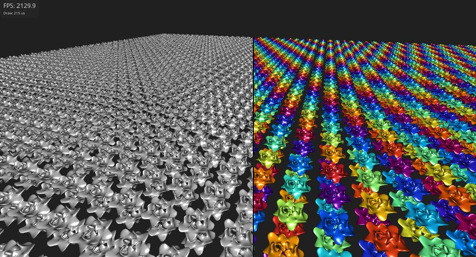

---

## [Compute rasterization](https://tellusim.com/04_hello_raster/)

https://github.com/Tellusim/Manual/tree/main/04_hello_raster

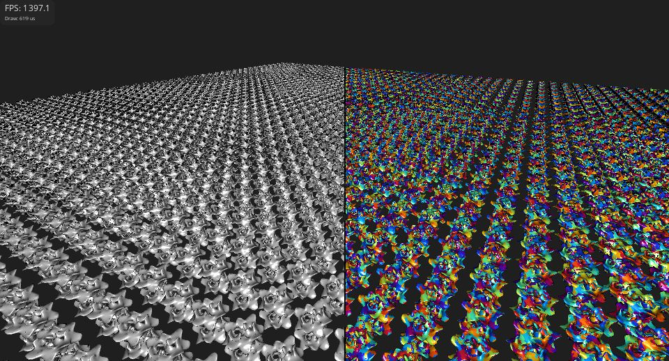

---

## [Hierarchical LOD Graphs](https://tellusim.com/03_hello_mesh/)

https://github.com/Tellusim/Manual/tree/main/03_hello_mesh/

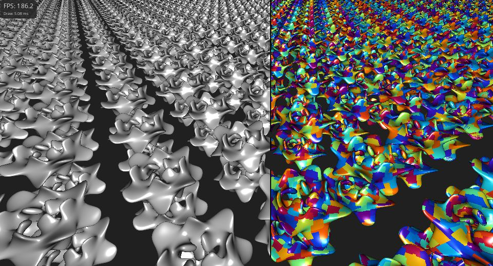

---

## [Particles Simuation](https://tellusim.com/02_hello_compute/)

https://github.com/Tellusim/Manual/tree/main/02_hello_compute/

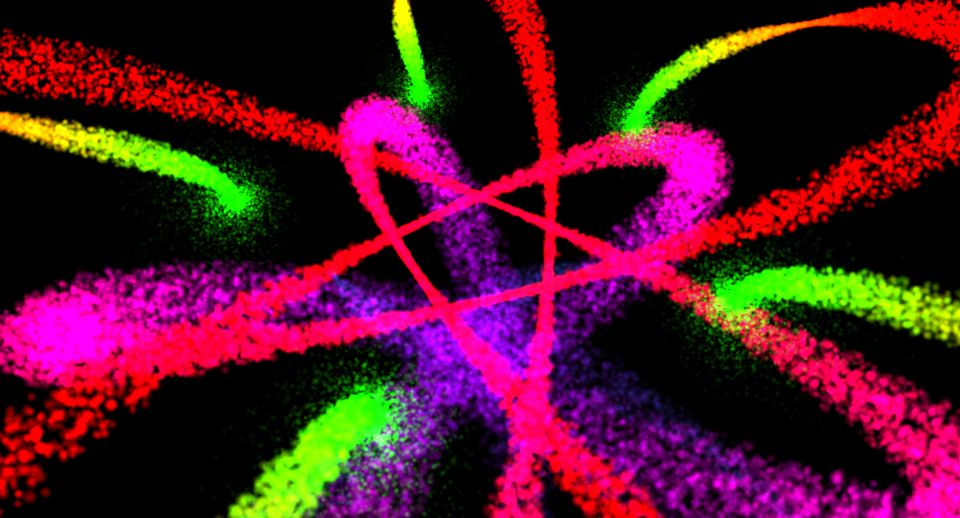

---

## [USDZ Model Loading](https://tellusim.com/01_hello_usdz/)

https://github.com/Tellusim/Manual/tree/main/01_hello_usdz/

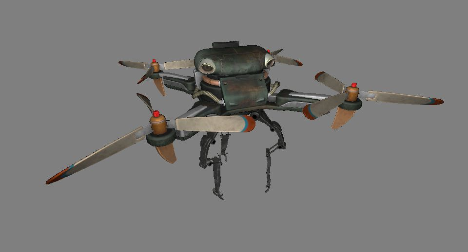

---

## [Hello Triangle](https://tellusim.com/00_hello_triangle/)

https://github.com/Tellusim/Manual/tree/main/00_hello_triangle

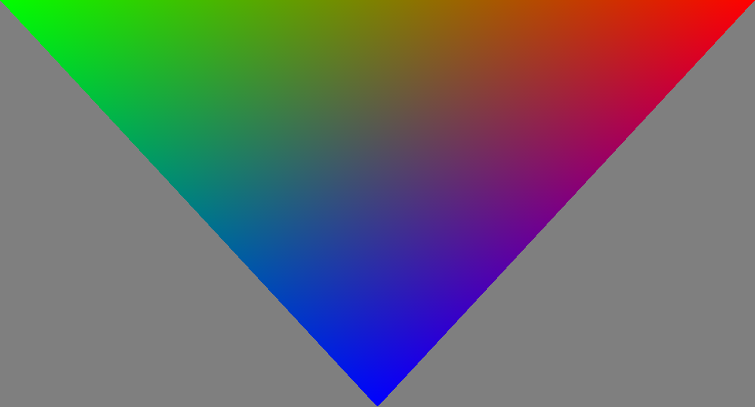
